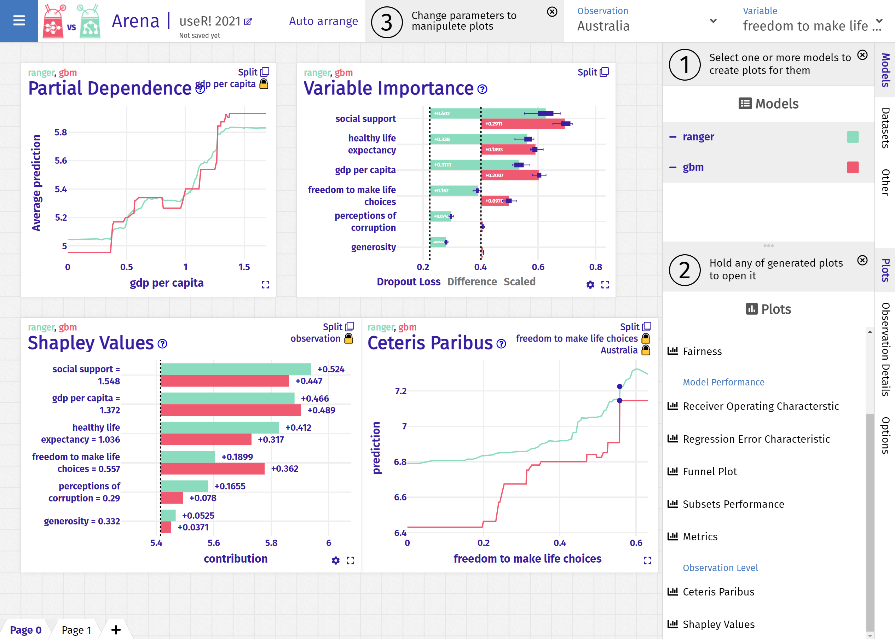

# user-21

Demo for the useR! 2021 conference talk:

> Open the Machine Learning Black-Box with modelStudio & Arena

Find a live demo at https://hbaniecki.github.io/user-21



## What factors correlate with happiness at national level?

1. Get data about happiness from 
https://www.kaggle.com/unsdsn/world-happiness

2. Train your favorite ML model that will predict the happiness score

3. Explain the model with [modelStudio](https://github.com/ModelOriented/modelStudio)

```r
library("DALEX")
library("modelStudio")
library("ranger")

# load data
happiness <- readRDS("happiness.rds")

# fit a model
model <- ranger(score~., data = happiness)

# create an explainer for the model  
explainer <- explain(model, data = happiness[,-1], y = happiness$score)

# make a Studio for the model
ms <- modelStudio(explainer,
                  happiness[c("Poland", "Finland", "Germany"),],
                  options = ms_options(margin_left = 220))
                  
# explain!
ms
```

4. Compare multiple models with [Arena](https://arena.drwhy.ai/docs/)

```r
library("DALEX")
library("arenar")
library("ranger")
library("gbm")

# load data
happiness <- readRDS("happiness.rds")

# fit models
model_rf <- ranger(score~., data = happiness)
model_gbm <- gbm(score~., data = happiness)

# create explainers for the models
explainer_rf <- explain(model_rf,
                        data = happiness[,-1],
                        y = happiness$score)
explainer_gbm <- explain(model_gbm,
                         data = happiness[,-1],
                         y = happiness$score)

# choose observations to be explained
observations <- happiness[1:10, ]

# make an Arena for the models
library("dplyr", quietly=TRUE, warn.conflicts = FALSE)
arena <- create_arena(live=TRUE) %>%
  push_model(explainer_rf) %>%
  push_model(explainer_gbm) %>%
  push_observations(observations)

# explain!
run_server(arena)
```

